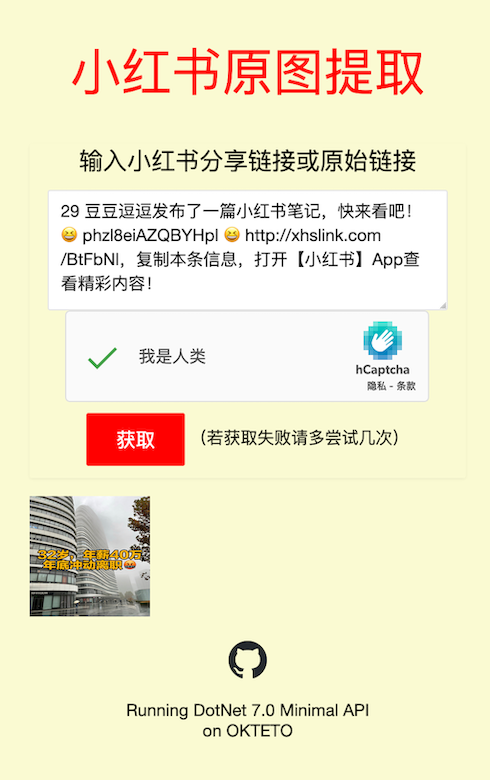
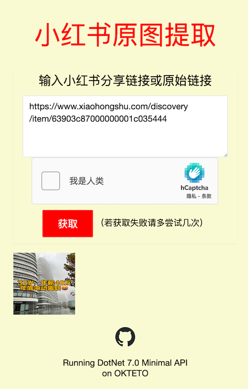

# XHS Pic Extractor

> 小红书原图提取工具

## 介绍

使用小红书过程中可能会看到想要保存下来的图，奈何有水印保存下来自用不够美观，所以弄了一个小红书原图提取工具。

本项目尝试使用目前最新的dotnet7.0，并使用Minimal API构造后端应用，对于小型后端接口项目来说，使用Minimal API比常规WEB API在文件结构上更精简，并且可以满足功能需求。

对项目的容器化过程比较顺利，除了配置CI/CD时候遇到一些坑...考虑后续替换更加简单稳定容器云进行自动化部署。

## 使用方法

输入小红书分享链接或原始链接后获取原图，点击原图即可下载。

1. 使用分享链接

   
   
2. 使用原始链接

   

## 使用技术

- 后端Minimal API: DotNet 7.0
- 前端UI: LayUI 2.5.7
- 验证码：HCaptcha

## 后端部署

```shell
docker pull injectrl/xhspicextractor:latest
docker run -d -it --name {name} -e HCaptchaSecret="xxx" -e CorsTarget="xxx" -p IP:Port:5000 injectrl/xhspicextractor:latest
```

## 目前服务端

部署并运行在OKTETO容器云